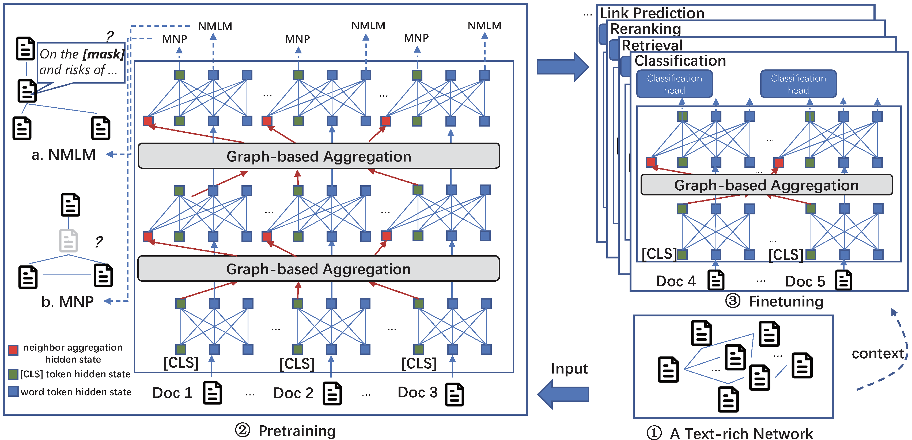

<!-- # Patton: Language Model Pretraining on Text-rich Networks -->
# Patton 

This repository contains the source code and datasets for [Patton: Language Model Pretraining on Text-rich Networks](), published in ACL 2023.

## Links

- [Requirements](#Requirements)
- [Overview](#Overview)
- [Datasets](#Datasets)
- [Pretraining Patton](#Pretraining-Patton)
- [Finetuning Patton](#Finetuning-Patton)
- [Citations](#Citations)

## Requirements

The code is written in Python 3.8. Before running, you need to first install the required packages by typing following commands (Using a virtual environment is recommended):

```
pip3 install -r requirements.txt
```

## Overview
**Patton** is a framework to pretrain language models on text-rich networks, with two strategies: network-contextualized masked language modeling and masked node prediction.

<p align="center">
  
</p>

## Datasets
**Download processed data.** To reproduce the results in our paper, you need to first download the processed [datasets](). Then put the datasets under ```data/``` and unzip them.
```
mkdir data
cd data/
unzip
cd ..
```

Create a new ```ckpt/``` folder for checkpoint saving and a new ```logs/``` folder for logging saving.
```
mkdir ckpt
mkdir logs
```


**Raw data & data processing.** Raw data can be downloaded from [MAG](https://zenodo.org/record/7611544) and [Amazon](http://jmcauley.ucsd.edu/data/amazon/links.html) directly. You can also find our data processing codes [here](). They might be useful if you want to obtain processed dataset for other networks in [MAG](https://zenodo.org/record/7611544) and [Amazon](http://jmcauley.ucsd.edu/data/amazon/links.html).

**Use your own dataset.** To run our model on your own data, you need to prepare the following things: (1) The network config file node_num.pkl. (2) Model training and testing files train.tsv, val.tsv, test.tsv. Please refer to the file in our processed dataset for their format information.

<!-- ### Data Processing
1. Run the cells in data_process/process_amazon.ipynb and data_process/process_mag.ipynb for amazon domain network and MAG domain network respectively.
2. Tokenize the text in train/val/test.
```
cd src/scripts
bash build_train.sh
``` -->

## Pretraining Patton
Pretraining Patton starting from bert-base-uncased.
```
bash run_pretrain.sh
```
Pretraining Patton starting from scibert-base-uncased.
```
bash run_pretrain_sci.sh
```

We support both single GPU training and multi-GPU training.

## Finetuning Patton

### Classification
Run classification train.
```
bash nc_class_train.sh
```

Run classification test.
```
bash nc_class_test.sh
```


### Retrieval
Run bm25 to prepare hard negatives.
```
cd bm25/
bash bm25.sh
```

Prepare data for retrieval.
```
cd src/
bash nc_retrieve_gen_bm25neg.sh
bash build_train.sh
```

Run retrieval train.
```
bash nc_retrieve_train.sh
```

Run retrieval test.
```
bash nc_infer.sh
bash nc_retrieval.sh
```

### Reranking
Prepare data for reranking.
```
bash scripts/match.sh
```

Run reranking train.
```
bash nc_rerank_train.sh
```

Run reranking test.
```
bash nc_rerank_test.sh
```

### Link Prediction
Run link prediction train.
```
bash lp_train.sh
```

Run link prediction test.
```
bash lp_test.sh
```

## Citations

Please cite the following paper if you find the code helpful for your research.
```
xxx
```


## Code base Structure
```
$CODE_DIR
    ├── ckpt
    ├── data
    │   ├── amazon
    │   │   ├── cloth
    │   │   ├── home
    │   │   └── sports
    │   └── MAG
    │       ├── CS
    │       ├── Geology
    │       └── Mathematics
    ├── src
    │   ├── OpenLP
    │   │   ├── __init__.py
    │   │   ├── __pycache__
    │   │   ├── arguments.py
    │   │   ├── dataset
    │   │   ├── driver
    │   │   ├── loss.py
    │   │   ├── models
    │   │   ├── modeling.py
    │   │   ├── retriever
    │   │   ├── trainer
    │   │   └── utils.py
    │   └── scripts
    │       ├── build_train.py
    │       ├── calculate_cmd.py
    │       ├── degree_jaccard_score.py
    │       └── text_jaccard_score.py
    └── logs
```